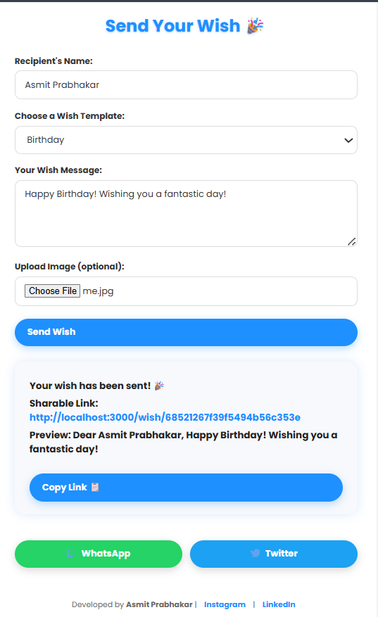

# 🎉 Wishify - Personalized Wish Sharing Web App

Wishify is a full-stack web application that lets users create personalized wishes (like Birthday, Anniversary, Good Luck, etc.) and share them using unique links. Users can optionally upload an image to enhance the wish, making it more heartfelt and visually appealing.

---

## 🌐 Live Demo

👉 [Wishify Live (example link)](https://your-deployment-link.com)

> Replace the above link with your actual deployment URL (e.g. from Render, Vercel, or Railway).

---

## 🧰 Tech Stack

| Area       | Technology          |
|------------|---------------------|
| Frontend   | HTML, CSS, JavaScript |
| Backend    | Node.js, Express.js |
| Database   | MongoDB Atlas       |
| File Uploads | Multer             |
| Deployment | Render / Railway / Vercel |
| Version Control | Git + GitHub   |

---

## 📸 Screenshots

### 🏠 Home Page (Create a Wish)


### 💌 Wish Display Page (Shared Link)


> Make sure to create a `screenshots` folder in your root project and place `home.png` and `wish.png` inside it.

---

## 🚀 Features

- 📝 Create custom wishes with name, message, and type
- 🖼️ Upload optional images (like cakes, flowers, etc.)
- 🔗 Generate and share unique links for each wish
- 🎊 Confetti animation and emojis for different wish types
- 📦 MongoDB stores all wish data and image links
- 📱 Responsive and mobile-friendly design

---

## 🛠️ Installation Guide

### Prerequisites
- Node.js and npm installed
- MongoDB Atlas account
- Git installed

---

### 🔧 Steps to Run Locally

1. **Clone the repository**

```bash
git clone https://github.com/Asmitworkspace/wishifyy.git
cd wishifyy
